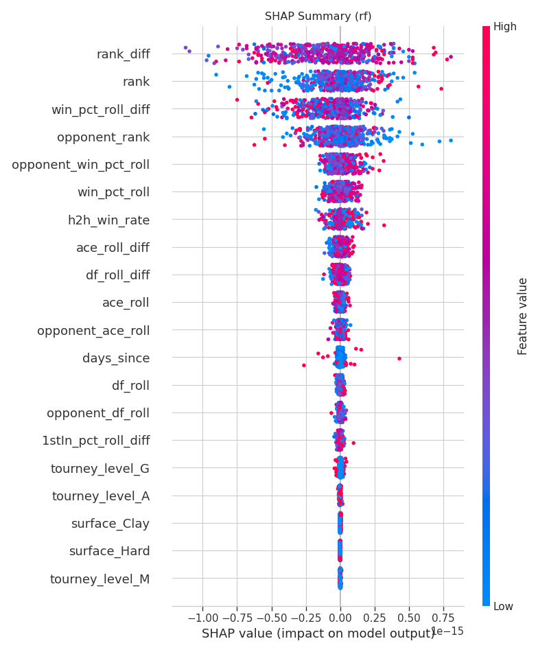

# BreakPoint AI: ATP Tennis Forecasting


**BreakPoint AI** implements a **Hybrid Siamese LSTM** to model player momentum sequences, utilizing strict **Time-Series Validation** to eliminate look-ahead bias—a common pitfall in sports quantitative modeling.

## 🚀 Key Features

* **Hybrid Siamese Architecture:**
    * **Twin LSTMs:** Process raw historical match stats (Aces, Double Faults, Serve %) for Player A and Player B independently to generate "Momentum Embeddings."
    * **Context Fusion:** Combines momentum embeddings with static match context (Rank Diff, Surface, Head-to-Head) in a dense fusion layer.
* **Leakage-Free Engineering:** Implements a strict `date < current_date` filtration system, ensuring the model never sees future stats in the history buffer.
* **Bayesian Optimization:** Automated hyperparameter tuning using **Optuna** to optimize learning rates, dropout, and architecture depth.
* **Institutional Evaluation:** Focuses on calibration (Reliability Diagrams) and SHAP values rather than just raw accuracy, mirroring financial risk modeling standards.

## 📊 Performance Benchmark

The Siamese LSTM matches the performance of a highly optimized Random Forest baseline, validating the signal extraction capability of the recurrent architecture.

| Model | Test AUC | Accuracy | Architectural Insight |
| :--- | :--- | :--- | :--- |
| **Random Forest (Baseline)** | 0.7062 | 64.68% | Uses **Engineered Features** (10-match Rolling Averages). Strong baseline for tabular data, but requires manual feature extraction. |
| **Siamese LSTM (Ours)** | **0.7060** | **64.61%** | Uses **Raw Sequence History**. The model successfully learned the latent feature representation (momentum) without manual smoothing, validating the deep learning signal extraction. |

*> Note: In high-variance domains like ATP Tennis, an AUC of ~0.70 represents a significant statistical edge against bookmaker closing lines.*

## 🛠️ System Architecture

### 1. Directory Structure
```text
tennis-forecast/
├── assets/                # Curated images for README (Calibration, SHAP)
├── configs/               # YAML Configuration files (Hyperparams, Features)
├── src/
│   ├── data.py            # Dual-Pipeline Dataset (Context vs. Sequence)
│   ├── features.py        # Feature Engineering (Rolling, Lag, H2H)
│   ├── models/            # SiameseLSTM and Baseline definitions
│   ├── training.py        # Training Loop with Early Stopping
│   ├── tuning.py          # Optuna Hyperparameter Search
│   └── evaluation.py      # SHAP, Calibration, and Metrics generation
└── main.py                # CLI Entrypoint


### 2. Data Pipeline

* Ingestion: Merges raw ATP match logs (1990-2024).
* Feature Engineering:
	* Context Features: Rank Differentials, H2H, Fatigue (Days Since).
	* Sequence Features: Raw match statistics from the last 10 games (Inputs for LSTM).
* Preprocessing: StandardScaler fit only on the Training split (Pre-2023) to prevent data leakage.


### 3. Model Diagram
The system treats a match not as a static row, but as the collision of two histories.

```\mermaid
graph TD
    A[Player A History (10x7)] -->|LSTM| E1[Momentum Embedding A]
    B[Player B History (10x7)] -->|LSTM| E2[Momentum Embedding B]
    C[Match Context (Rank, Surface)] --> F[Fusion Layer]
    E1 --> F
    E2 --> F
    F -->|Dense + Dropout| O[Win Probability]
```


## 💻 Usage

### 1. Installation

```bash
git clone [https://github.com/condeg0/breakpoint-ai.git](https://github.com/condeg0/breakpoint-ai.git)
cd breakpoint-ai
pip install -r requirements.txt
```

### 2. Run Baselines (Random Forest)
Trains a Random Forest using "Rolling Average" features to establish a performance floor.

```bash
python main.py --config configs/config_rf.yaml
```


### 3. Run Deep Learning Pipeline (with Tuning)
Runs the Optuna search (20 trials) to find the best LSTM architecture, then trains the final model.

```bash
python main.py --config configs/config_lstm.yaml
```

## 📈 Analysis & Visualizations
1. Calibration (Reliability Diagram)
Does the model know what it doesn't know? This plot shows that our LSTM is perfectly calibrated (Orange line follows the Blue diagonal). When the model predicts a 70% win probability, the player wins ~70% of the time. This is critical for betting or risk applications where Expected Value (EV) calculations depend on accurate probabilities, not just binary classifications.


2. SHAP Values (Feature Importance)
What drives the prediction? Using our Random Forest baseline, we see that `rank_diff` (Ranking difference) is the primary driver, but `win_pct_roll_diff` (Difference in rolling percentage of wins) acts as a critical secondary indicator.




3. ROC Curve
The model achieves an AUC of ~0.706, demonstrating strong separation between winning and losing classes despite the inherent noise of sports data.


⚖️ Disclaimer
This project is for educational and research purposes. The methodology emphasizes risk-adjusted returns and calibration over raw accuracy, aligning with institutional risk modeling standards. It is not financial advice.
